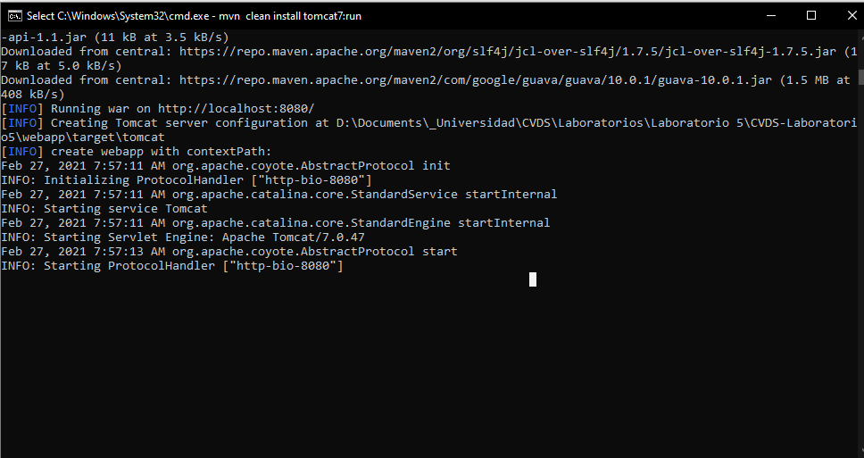
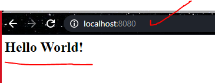
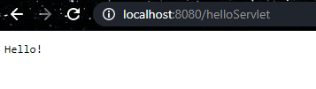
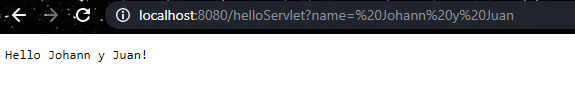
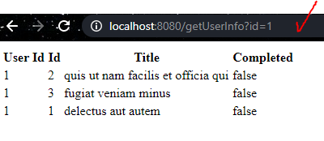
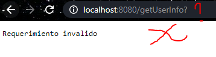
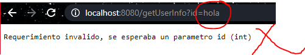

# Ciclos de vida y desarrollo de Software

### Parte II - HACIENDO UNA APLICACION WEB DINAMICA DE BAJO NIVEL

### Creamos el proyecto maven


#### El puerto TCP/IP para el servidor Tomcat esta configurado en el puerto :8080

### Compilamos y ejectuamos la aplicacion en el servidor Tomcat usando el siguiente comando

```
mvn package 
mvn tomcat7:run
```

En caso de obtener algun error con el inicio del servidor " No plugin found for prefix 'tocmat7' in the current project and in the plugin groups [org.apache.maven.plugins, org.codehaus.mojo] available from the repositories"
usar el siguiente comando:
```
mvn clean install tomcat7:run
```
Debemos obtener el siguiente mensaje:


Una vez nuestro servidor este funcionando, nos iremos a nuestro navegador de 
preferencia y entraremos en la direccion ip: localhost:8080


Y si entramos en nuestra direccion sobre la cual haremos las peticiones "/helloServlet"
veremos el saludo desde nuestra peticion


Ahora jugaremos con los parametros de nuestro GET para ello agregaremos a nuestra
url el valor "/helloServlet?name= Johann y Juan" y obtenremos el sigueinte resultado


### Creando un nuevo servicio 

Una vez creemos nuestro nuevo servicio de tipo GET realizamos las pruebas correspondientes

- El servidor responde de manera correcta y devuelve contenido



- No se indican parametros



- El parametro no es un entero



- Ell valor ingresado no existe


